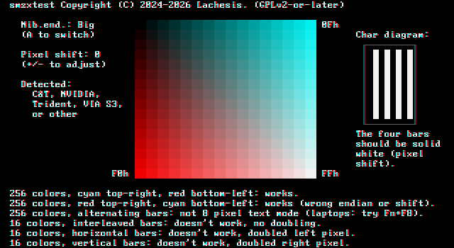

# smzxtest

Tests if a VGA-compatible chipset supports MegaZeux's 256 color text mode ("Super MegaZeux").



## Usage

This program requires no 32-bit extenders or other external files; just copy it
to your DOS installation or a FreeDOS USB installer drive and run it from the
DOS prompt.

For best results, submit an issue with your hardware and
*a picture of the screen* and one of us can add it to the
[wiki](https://www.digitalmzx.com/wiki/Super_MegaZeux#Compatibility).
You should provide the specific video adapter model and, if it is
embedded in a motherboard/laptop/CPU, the specific model of the device
it is embedded in.

## Explanation

The VGA Mode Control register bit 6, when enabled, causes the VGA to switch
from interpreting color data bytes in video memory as two 4-bit color indices
to interpreting these bytes as a single 8-bit color index (used to draw a
single "wide" pixel). This bit was only ever supposed to be enabled for mode 13h.

Most VGA implementations ignore this bit outside of 256-color graphical
modes, but a few do not, which allows an undocumented 256-color text mode
to be used. In MegaZeux, this is referred to as "Super MegaZeux" or "SMZX".
No other software (as far as we know) uses this, so it's referred to as
"SMZX" here as well.

Other VGA implementations will produce "wide" pixels but only use one of the
two original 4-bit color indices for the wide pixel. This is referred to as
"doubling" in smzxtest.

See the [MZXWiki entry](https://www.digitalmzx.com/wiki/Super_MegaZeux)
for more information.

### Nibble endian

Palette indices in 16 color modes (including text mode) are stored in VRAM
as nibbles. To save space, the colors of two adjacent pixels are stored in
the a single byte. In 256 color mode, the entire byte is used as a palette index.

The order in which the two adjacent 16 color pixel indices are stored in that
byte is referred to in smzxtest as "nibble endian". When the left pixel index
is stored in the upper nibble of the byte and the right pixel index is stored
in the lower nibble of the byte, this is "big" nibble endian. When the left
pixel index is stored in the lower nibble of the byte and the right pixel
index is stored in the upper nibble of the byte, this is "little" nibble endian.

smzxtest sets all 256 entries in the VGA palette, using the least significant
nibble of the 8-bit palette index to control green+blue channel levels and
the most significant nibble to control red levels. It then writes characters
for all 256 possible color attributes sequentially in a 16x16 color box, using an
edited character where every left pixel is unset and every right pixel is set.

For graphics adapters that combine the two colors in a "big endian" manner,
the resulting 4-bit color indices are combined into to sequential 8-bit color
indices, so the displayed colors are increasingly cyan from left to right and
increasingly red from top to bottom.

For graphics adapters that combine the two colors in a "little endian" manner,
the box will appear to be flipped diagonally, so to display the same image that
appears for the "big endian" adapters, the color index nibbles need to be
switched when constructing the palette to compensate for this. This compensation
is automatically enabled for cards that are known to have this quirk;
press 'A' in smzxtest to toggle it.

### Horizontal pixel shift

VGA has a horizontal pixel shift register that displaces the displayed image
`x` pixels to the left, where `x` is between 0 and 15. Changing this value
changes the location that pixels are stored in VRAM, which effectively flips
the nibble endian on odd values. For this reason, usually this register
should be left at 0.

However, for unknown reasons, ATI graphics adapters seem to shift text mode
by 1 pixel. Because ATI adapters *also* handle 16 color indices in a "little"
endian manner, this causes the image to appear similar to C&T/NVIDIA/etc.,
but with pixels from adjacent characters "bleeding" into each other. To fix
this, the horizontal pixel shift needs to be set to 1 (and compensation for
"little" nibble endian also needs to be enabled).

smzxtest automatically sets horizontal pixel shift to 1 for detected ATI
adapters. It can be adjusted by pressing '+' and '-' to increase or decrease
`x`, though only 0 or 1 should be necessary.

### Text modes with characters wider than 8 pixels

On laptops, some adapters will automatically upscale 8x14 character text mode
graphics to 9x16 or larger. When SMZX is enabled, this can cause the nibble endian
to "flip" every other character, causing columns that look "correct" interleaved
with columns that look "incorrect". It can also cause gaps to form between
adjacent characters that should not have them.

Laptops typically allow this upscaling to be disabled with a Fn+F# key combination
(on IBM ThinkPads, the combination is usually Fn+F8).

### Known vendors that support SMZX

* NVIDIA: NVIDIA cards up through the GeForce 7 series, and possibly some
  later, support SMZX; support was removed at an unknown point.

* ATI: all tested ATI cards supporting VGA up through the 9000 series
  support SMZX; support is removed in the X1000 series (X800 needs testing).
  For unknown reasons, text mode appears to be shifted in the buffer
  slightly, so ATI cards require a pixel shift of 1 and the nibble endian
  to be flipped to work the same as other vendors.

* Chips & Technologies: most or all tested chipsets that support VGA also
  support SMZX. There may be a few that do not.

* Trident: some Trident TVGA chipsets support SMZX. TGUI chipsets also
  need testing. Later Trident chipsets do NOT support SMZX.

* VIA S3: later S3 graphics adapters embedded into VIA chipsets appear to
  support SMZX, despite earlier S3 chipsets not supporting it.

* Oak Technologies OTI-037C and possibly other similar cards support SMZX.
  These combine the nibbles in a little endian manner.

### Emulation

* In DOSBox-X, SMZX emulation can be enabled with the setting
  "enable supermegazeux tweakmode" under the video category.

* 86Box supports SMZX unintentionally, though it will inappropriately
  display it correctly for adapters that are not supposed to and does
  not accurately emulate the ATI and Oak Technologies quirks.
  Trident TVGA 9000B and Chips & Technologies B69000 are the safest adapters
  to select if you are intentionally trying to emulate SMZX, though the
  former does not support VBE 2.0 without a driver and the latter has
  not yet been tested in hardware.

## Compiling

### Turbo C

Requires Borland Turbo C 2.01 and Borland Turbo Assembler.

```bat
tcc -B smzxtest
```

### Watcom C

```bat
wcl -bt=dos smzxtest.c
```

### gcc-ia16

```sh
ia16-elf-gcc -o smzxtest.exe smzxtest.c -li86
```

## License

This program is free software; you can redistribute it and/or
modify it under the terms of the GNU General Public License as
published by the Free Software Foundation; either version 2 of
the License, or (at your option) any later version.

This program is distributed in the hope that it will be useful,
but WITHOUT ANY WARRANTY; without even the implied warranty of
MERCHANTABILITY or FITNESS FOR A PARTICULAR PURPOSE.  See the GNU
General Public License for more details.

You should have received a copy of the GNU General Public License
along with this program; if not, write to the Free Software
Foundation, Inc., 51 Franklin Street, Fifth Floor, Boston, MA 02110-1301 USA
